<p align="center">
  <a href="https://yazan-o.github.io/afterrain/"></a>
</p>

<p align="center">
  <a href="https://oneaquahealth-ieee-hackathon.devpost.com/"></a>
  <a href="https://oneaquahealth-ieee-hackathon.devpost.com/"></a>
  <a href="https://github.com/Yazan-O"></a>
  <a href="https://github.com/AbdullahOsmanR"></a>
  <br>
  <a href="https://www.oneaquahealth.eu/"></a>
  <a href="https://www.oneaquahealth.eu/"></a>
  <a href="https://yazan-o.github.io/afterrain/"></a>
  <br>
  <a href="https://yazan-o.github.io/afterrain/"></a>
  <a href="https://github.com/Yazan-O/afterrain/actions/workflows/pages.yml"></a>
  <a href="LICENSE"></a>
  
  
  
  <a href="fhir/"></a>
</p>

<p align="center">
  <a href="https://yazan-o.github.io/afterrain/">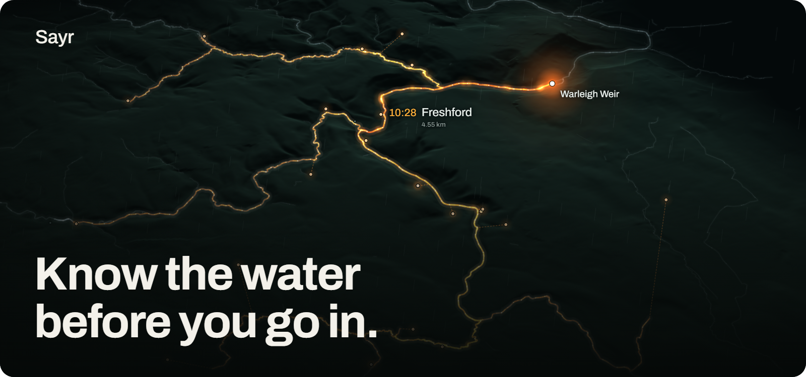</a>
</p>

<p align="center">
  <b>AfterRain forecasts the chance that each city stream is over 900 E. coli per 100 ml after rain,<br>hour by hour for the coming week.</b><br>
  It shows where nobody has measured, asks for the next sample, and updates the moment the result comes in.
</p>

<h3 align="center">
  <a href="https://yazan-o.github.io/afterrain/">Open the live demo</a>
  &nbsp;&nbsp;&middot;&nbsp;&nbsp;
  <a href="https://youtu.be/7p_uU6psF5U">Watch the video (3 to 5 min)</a>
</h3>

<p align="center">
  <sub>Phone or laptop, no login. Built for the <b>OneAquaHealth IEEE Global Hackathon 2026, Track 6: Resilience Informatics</b>, on OneAquaHealth's five cities, their open API and their FHIR guide.</sub>
</p>

<br>

## The story

<table>
  <tr>
    <td width="50%">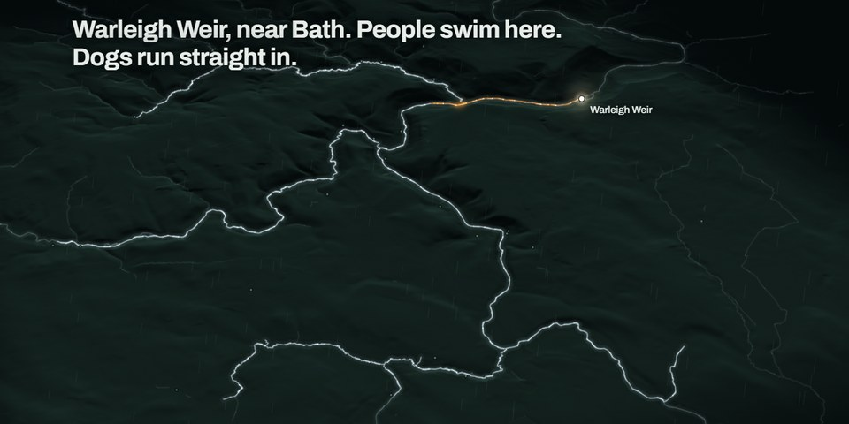</td>
    <td width="50%">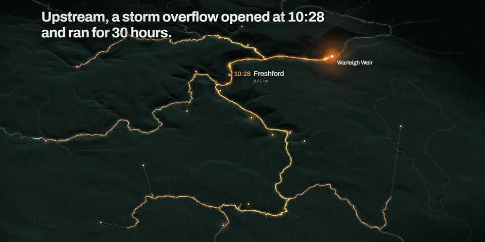</td>
  </tr>
  <tr>
    <td><b>The weir.</b> Warleigh Weir, on the River Avon near Bath.</td>
    <td><b>The storm.</b> 23 September 2024: an overflow 4.55 km upstream runs for 30 hours.</td>
  </tr>
  <tr>
    <td>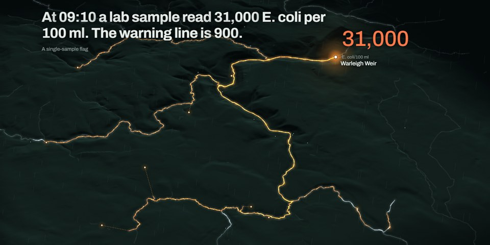</td>
    <td>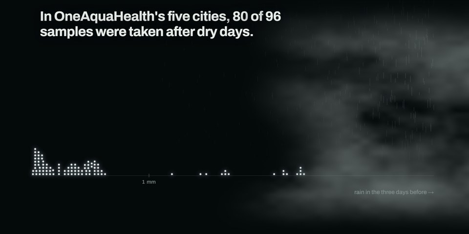</td>
  </tr>
  <tr>
    <td><b>The morning after.</b> <b>31,000</b> E. coli per 100 ml. The line is 900.</td>
    <td><b>The blind spot.</b> In OneAquaHealth's five cities, <b>80 of 96</b> samples were taken after dry days.</td>
  </tr>
  <tr>
    <td>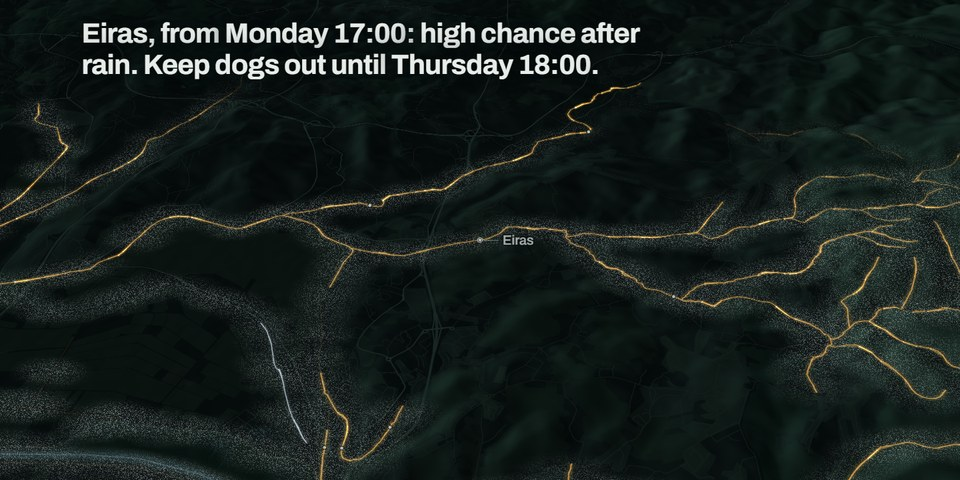</td>
    <td>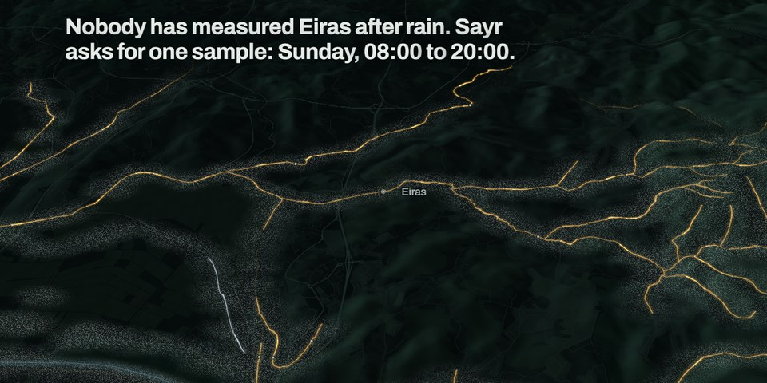</td>
  </tr>
  <tr>
    <td><b>The forecast.</b> AfterRain forecasts the hours after rain, in one plain sentence per stream.</td>
    <td><b>The request.</b> Where nobody has measured, AfterRain asks for one sample and a time window.</td>
  </tr>
</table>

<p align="center">
  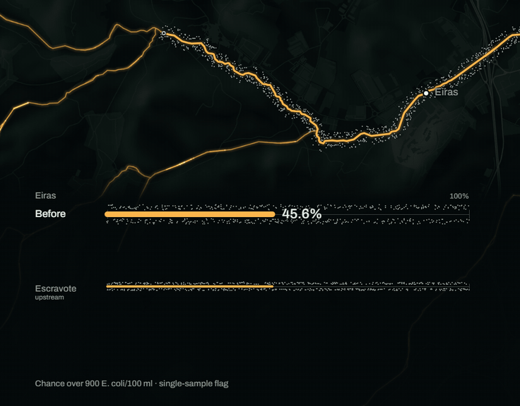
</p>

<p align="center"><b>The answer.</b> An example test reading at Eiras, Coimbra, moves the chance from <b>45.6% to 23.8%</b>.</p>

<br>

## Why it matters

Rain flushes sewage and runoff into city streams, while people and dogs are still in the water.

> ## 3,614,428 hours
> England's storm overflows spilled for 3,614,428 hours in 2024: more than 412 years of spilling, in one year.[^ea2024]

<table>
  <tr>
    <td width="33%" valign="top">

# 291,492

storm overflow spills in England in 2025, an average of 20.5 per overflow, with every overflow now monitored.[^ea2025]

</td>
    <td width="33%" valign="top">

# 6,780

spills in the 2025 bathing season from the **1,140 overflows** linked to England's bathing waters.[^eabathing]

</td>
    <td width="33%" valign="top">

# 47%

of Europe's roughly **1,200 river bathing sites** reached excellent quality in 2025, against **88%** of coastal sites.[^eea2025]

</td>
  </tr>
  <tr>
    <td valign="top">

# 2033

By 31 December 2033, every EU agglomeration of **100 000 population equivalent and above** must have an integrated urban wastewater management plan (Article 5).[^uwwtd]

</td>
    <td valign="top">

# 2% or less

an indicative target for storm overflows, as a share of the annual collected load, by 2039 for those cities.[^uwwtd]

</td>
    <td valign="top">

# One Health

The same Directive frames its health goal in the One Health approach: people, animals and ecosystems.[^uwwtd]

</td>
  </tr>
</table>

In 2025, **12 of England's 14 designated river bathing waters were rated poor.**[^eariver]

The EEA names combined sewer overflows, stormwater runoff and short-term pollution after heavy rain as the pressures. Swimming in faecally polluted water brings stomach upsets and diarrhoea, and ear, eye and upper respiratory infections.[^eea2025] The Directive states that overflows and runoff **are expected to increase** with urbanisation and the changing rain regime of climate change.[^uwwtd]

**What this means for AfterRain.** Every one of those plans needs storm monitoring that starts somewhere. AfterRain turns the hours after rain into a forecast a city can act on today, and into a sampling request that tells its team where and when to measure next.

<br>

## What AfterRain does

<p align="center">
  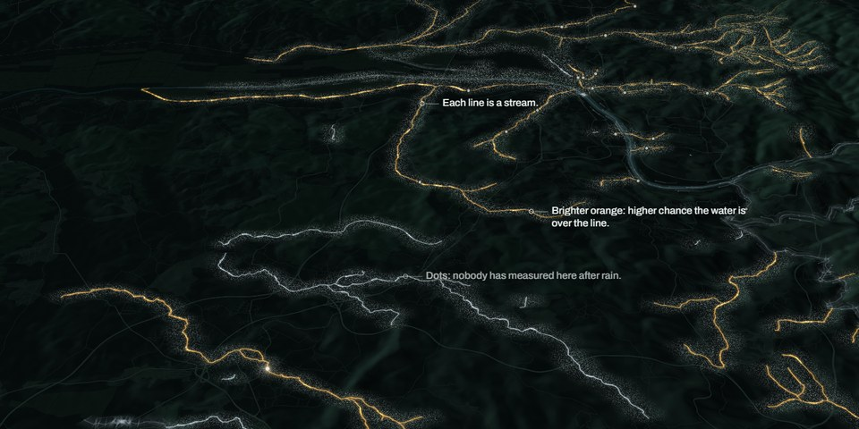
</p>

1. **Forecasts every stream, hour by hour, for a week.** A 51-member ECMWF rain ensemble drives each stream's chance of passing 900 E. coli per 100 ml, the single-sample flag.
2. **Shows where nobody has measured after rain.** Uncertainty is drawn as fog on the map, so a blind spot is visible at a glance.
3. **Asks for the next sample, then updates on the spot.** For every site and hour, AfterRain scores how much fog one sample clears, counting only the warning hours left after a 24-hour lab turnaround. The top-scoring site and window get the request. Enter the reading and the stream's answer redraws.

<p align="center"><sub>Every stream speaks in one plain sentence</sub></p>
<h3 align="center">"Eiras, from Monday 17:00: high chance after rain.<br>Keep dogs out until Thursday 18:00."</h3>

<br>

<p align="center">
  <picture>
    <source media="(prefers-color-scheme: dark)" srcset="assets/loop-dark.svg">
    <source media="(prefers-color-scheme: light)" srcset="assets/loop-light.svg">
    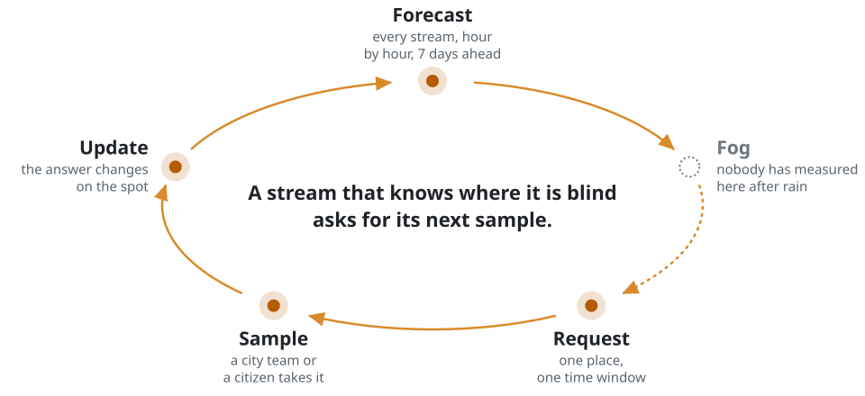
  </picture>
</p>

<br>

## Proof

<p align="center">
  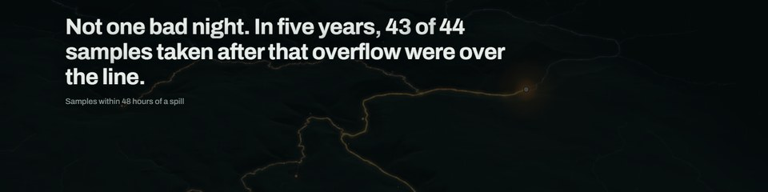
</p>

Measured on real E. coli samples from public data. The Bath, Farleigh and Toulouse values are rows in [`data/out/numbers.json`](data/out/numbers.json), each naming its input files and the function that computed it, rebuilt by one command.

| Test | Result |
|:--|:--|
| **Bath, 2021 to 2025:** samples within 48 hours of an upstream storm-tank spill | **43 of 44** over 900 (median 6,400). All other samples: 102 of 278 (median 700) |
| **Bath, held-out 2025 test** (trained on 2021 to 2024, tested once) | Caught **13 of 14** exceedances, **AUC 0.95**. Brier 0.113 against 0.242 for the usual rate |
| **River Frome, Farleigh Hungerford**, no refitting, no named overflows | Caught **69 of 93** exceedances, **AUC 0.81** |
| **Toulouse, Garonne at Pech David** (Hub'Eau, 118 samples) | After three dry days **0 of 36** over 900. After 5 mm or more of rain in two days **6 of 30**. Otherwise 4 of 88 |
| **Does a requested sample sharpen the forecast?** Replay on 440 archived results, Bath and Toulouse | At Toulouse, one to five requested counts a year cut prediction error by **0.09 to 0.15 log loss**, every 95% interval excluding zero |

900 E. coli per 100 ml is used as a single-sample flag. The EU applies it to a 90th percentile.

**Check it yourself.** Two public Wessex Water map layers confirm the Bath storm: the overflow log (site `13130S`, spill from 09:28 UTC on 23 September 2024 to 15:39 UTC the next day) and the river-quality layer at Warleigh Weir (24 September 2024, 09:10: E. coli 31,000).

<br>

## Built for OneAquaHealth

<p align="center">
  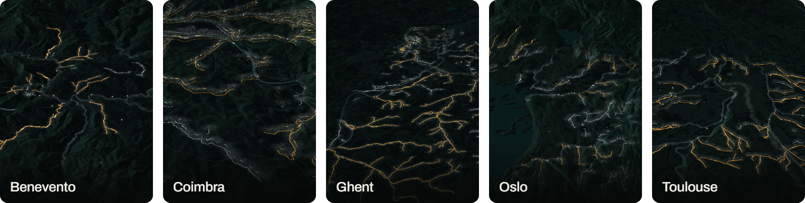
</p>

OneAquaHealth is a **€5.09 million Horizon Europe project**, coordinated by the University of Coimbra with 14 partners from 2023 to 2026, building an AI-powered early-warning system for urban streams.[^cordis] It links ecosystem health and human wellbeing.[^oah] Track 6 asks for early warning and resilience planning: predictive dashboards, alerts and resilience tools.[^devpost] AfterRain is that early warning, working today on their data, opening in Coimbra.

- **Their five cities.** Benevento, Coimbra, Ghent, Oslo and Toulouse, 106 research sites. Coimbra opens the app; every city is one tap away.
- **Their API, read-only.** Sites, 70 citizen sites, urban context, daily weather and the 96 pathogen, fecal and antibiotic-resistance risk scores. The 80-of-96 finding is computed from these samples.
- **Their FHIR guide.** AfterRain writes a 925-resource package on the OAH-FHIR profiles. The HL7 validator checks **927 files with 0 errors**, and the app serves **872** of them: a risk record for each of the 106 sites and every resource it references.
- **A new alert profile.** `AlertOah`, a FHIR `Communication` with an "until" extension, carries messages such as "keep dogs out until this time". The guide does not model alerts yet; AfterRain offers it to the authors.
- **One Health.** People, dogs and the stream share one estimate. A child, a swimmer, a dog and a heron stand on every stream's bank.
- **Citizen science.** Citizen samplers get one clear request instead of a dashboard. Their reading updates the stream on the spot.

### Mapped to the judging criteria

| Criterion | What AfterRain shows | Where to see it |
|:--|:--|:--|
| **Impact and alignment** (30%) | Early warning for the hours after rain in all five OneAquaHealth cities; people, dogs and the stream in one estimate; a direct line to the EU's 2033 storm plans | Live demo, Coimbra; [Why it matters](#why-it-matters) |
| **Innovation and creativity** (20%) | A stream that knows where it is blind and asks for its next sample; uncertainty drawn as fog | Live demo, the story from "AfterRain forecasts those hours."; [the loop](#what-afterrain-does) |
| **Technical implementation** (20%) | 43 of 44 and a held-out AUC 0.95 on real samples; exact Bayesian update in the browser; 927 FHIR files, 0 errors; one command rebuilds every number | [Proof](#proof); [Under the hood](#under-the-hood) |
| **Usability and UX** (15%) | One plain sentence per stream; no login; phone and laptop; a narrated story that hands over to free exploration | Live demo on a phone |
| **Feasibility and scalability** (15%) | Static site, no compute server, daily forecast build; England's ten water companies already publish live overflow status, the next river in line | [Under the hood](#under-the-hood) |

### What's next

1. **A pilot in one OneAquaHealth city:** two storm-triggered sampling days from AfterRain's requests, each result updating the stream.
2. **`AlertOah`** offered to the guide's authors.
3. **England next.** A new river takes its overflow feed, a model fit and a test on its own samples.
4. **Storm plans in every large EU city.** AfterRain's sampling requests give the Article 5 plans' storm monitoring a place to start.

<br>

## Under the hood

<details>
<summary><b>Architecture</b></summary>

<br>

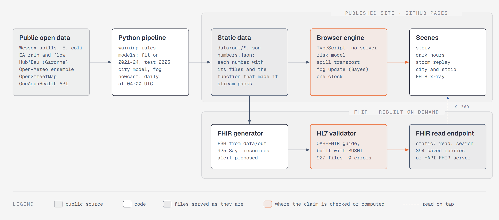

Public sources feed one Python pipeline, which writes static JSON with provenance. The browser runs the model, the spill transport, the fog update and the clock in TypeScript, so the site needs no compute server. A FHIR generator turns the same JSON into OAH-FHIR resources, the HL7 validator checks them, and a static read-only FHIR surface serves them (or a HAPI FHIR server loads them). Diagram source: [docs/architecture.svg](docs/architecture.svg), [docs/architecture.html](docs/architecture.html).

**App routes.** `#/story` (default, the narrated story), `#/dark-hours` (the 96 samples on a rain timeline), `#/replay` (the Bath storm of 23 September 2024), `#/city/CO` (also `BE`, `GH`, `OS`, `TO`). Tap a number to see the FHIR resource that holds it.

</details>

<details>
<summary><b>How to run</b></summary>

<br>

Python 3.13, Node 22.12 or later (LTS 22 or 24), npm 11. Java 17 and the HL7 `validator_cli.jar` for the FHIR build only.

**Web app** (from `web/`). `data/out` is in the repository, so the app runs without a pipeline build:

```
npx npm@11 ci      # npm 10.9 crashes resolving Vitest's optional peers
npm run dev        # copies data/out, builds the stream packs, starts Vite on http://localhost:5173/
npm run build      # production build in web/dist
npm test           # schemas, model, replay, transport, fog, time zones
```

`npm run dev` needs Python with Pillow (`pip install -r requirements.txt`) and fetches terrain tiles on its first run. For GitHub Pages, build with `SAYR_BASE=/afterrain/`. [web/README.md](web/README.md) documents the scenes, the film clock and the quality checks.

**Pipeline** (from the repository root):

```
pip install -r requirements.txt
python -m pipeline build              # download every input, recompute every number, write data/out/
python -m pipeline build --offline    # the same from the cached inputs in data/raw/, after one online build
python -m pipeline nowcast            # refetch the 7-day rain ensemble, rewrite data/out/nowcast_<city>.json
python -m pytest                      # the checks on the published numbers
```

A missing input stops the build with its file name and URL. Nothing is filled in. The Alewife Brook files (MWRA, MassDEP) state no licence, so they are not in this repository; `build` downloads them into the git-ignored `data/raw/restricted/`.

**FHIR** (from `fhir/`):

```
npm ci
npm run fhir          # build the guide and AfterRain's resources, validate them, write fhir-static/
npm run fhir:test     # re-run the validator and check the values against data/out
npm run fhir:serve    # read-only FHIR surface on http://127.0.0.1:8777/
```

Point the build at Java and the validator with `FHIR_JAVA` and `FHIR_VALIDATOR_JAR`. [fhir/README.md](fhir/README.md) has the full steps and the HAPI FHIR option.

**Live site.** The `pages` workflow deploys `web/dist` to GitHub Pages on every push to `main`, rebuilding and validating the FHIR resources first. During judging the site shows the submitted forecast of 3 October 2026, so it matches the film and the write-up. One run of the `nowcast` workflow refetches the forecast, rewrites the nowcast and redeploys; set back on its daily schedule, it keeps every stream current.

</details>

<details>
<summary><b>How a request is chosen</b></summary>

<br>

In `pipeline/nowcast.py`, the sampling hour may be any forecast hour from 08:00 to 19:00 local. Its score is the expected fog reduction from one E. coli count, summed over the warning hours whose result is back in time (`LAB_TURNAROUND_H` = 24 h in `pipeline/config.py`). The window is the contiguous same-day hours scoring at least 0.8 of the best. The chance shown is the posterior predictive, averaged over the site's offset grid (`pipeline/offsets.py`).

</details>

<details>
<summary><b>Data and licences</b></summary>

<br>

Wessex Water (CC BY 4.0), Environment Agency (Open Government Licence v3.0), Hub'Eau (Licence Ouverte 2.0), Open-Meteo (CC BY 4.0), OpenStreetMap (ODbL), and the OneAquaHealth public API (no licence stated; used read-only). Every source, URL and licence is in [data/LICENSE-DATA.md](data/LICENSE-DATA.md). The OneAquaHealth FHIR guide states no licence; it is fetched at build time and not stored here.

Contains Wessex Water data (CC BY 4.0), Environment Agency data (OGL v3.0), (c) OpenStreetMap contributors (ODbL), weather data by Open-Meteo.com (CC BY 4.0), Hub'Eau / eaufrance data (Licence Ouverte 2.0), and OneAquaHealth data. Map tiles by OpenFreeMap, rendering by MapLibre GL JS. Terrain: Terrain Tiles by Mapzen on AWS Open Data, from EU-DEM (produced using Copernicus data and information funded by the European Union), (c) Environment Agency copyright and/or database right 2015 (all rights reserved), (c) Kartverket, ArcticDEM (DigitalGlobe imagery, National Science Foundation awards 1043681, 1559691 and 1542736), SRTM and GMTED2010 courtesy of the U.S. Geological Survey, and ETOPO1 (U.S. National Oceanic and Atmospheric Administration); the sources per city are in [data/LICENSE-DATA.md](data/LICENSE-DATA.md). FHIR tooling: SUSHI, the HL7 FHIR validator and HAPI FHIR.

</details>

<br>

### Team AfterRain

- **[Mohamad Yazan Sadoun](https://github.com/Yazan-O)** · University of Oklahoma, INQUIRE Lab
- **[Abdullah Osman](https://github.com/AbdullahOsmanR)** · University of Istanbul

Built by the AfterRain team, a team of students, for the OneAquaHealth IEEE Global Hackathon 2026. Thanks to the OneAquaHealth consortium for the open API and the OAH-FHIR guide. Code: MIT.

[^ea2024]: Environment Agency, "Water and sewerage companies in England: environmental performance report for 2024", section 7.2, 23 October 2025. https://www.gov.uk/government/publications/water-and-sewerage-companies-in-england-environmental-performance-report-2024/water-and-sewerage-companies-in-england-environmental-performance-report-for-2024
[^eariver]: Environment Agency blog, "Improving inland bathing waters: why progress takes time", 28 November 2025. https://environmentagency.blog.gov.uk/2025/11/28/improving-inland-bathing-waters-why-progress-takes-time/
[^cordis]: CORDIS, OneAquaHealth, Horizon Europe grant 101086521 (total cost EUR 5,085,113.75). https://cordis.europa.eu/project/id/101086521
[^ea2025]: Environment Agency and Defra, "Fewer and shorter storm overflow spills in 2025, new monitoring data shows", 26 March 2026. https://www.gov.uk/government/news/fewer-and-shorter-storm-overflow-spills-in-2025-new-monitoring-data-shows
[^eabathing]: Environment Agency blog, "Bathing season 2025 storm overflow EDM data analysed", 4 December 2025. https://environmentagency.blog.gov.uk/2025/12/04/bathing-season-2025-storm-overflow-edm-data-analysed
[^eea2025]: European Environment Agency, "European bathing water quality in 2025". https://www.eea.europa.eu/en/analysis/publications/european-bathing-water-quality-in-2025
[^uwwtd]: Directive (EU) 2024/3019 concerning urban wastewater treatment (recast), Official Journal L, 12.12.2024: recital 11, Article 5(1), Annex V point 2(a). https://eur-lex.europa.eu/eli/dir/2024/3019/oj/eng
[^oah]: OneAquaHealth project site. https://www.oneaquahealth.eu/
[^devpost]: OneAquaHealth IEEE Global Hackathon, overview page. https://oneaquahealth-ieee-hackathon.devpost.com/
